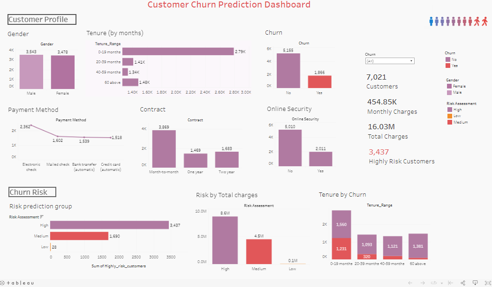
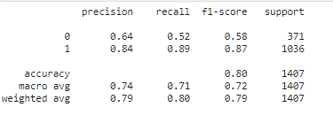
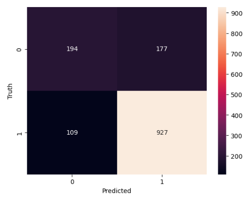
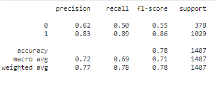
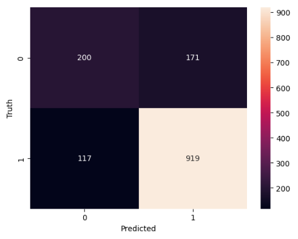

# Customer_Churn_Prediction
### Overview :
An end-to-end project involves conducting Exploratory Data Analysis (EDA) using Tableau to analyze and visualize data. The primary goal is to predict customer churn utilizing both XGBoost and Artificial Neural Network (ANN) models.

Kaggle link : https://rb.gy/v19bmg
### EDA with Tableau :
 
### EDA with python :
-->Check out Customer_churn_prediction.ipynb
### Insights 🔮
- Short-term contracts, notably month-to-month, result in a significant increase in churn rates.
- Two-year contracts showcase a commendably low churn rate.
- Customers with a one-year tenure experience a substantial decrease in churn, emphasizing the value of longer relationships.
- Electronic check payments are associated with a higher churn rate, while credit card payments provide stability.
- Customers without internet service display an impressively low churn rate.
- However, those with Fiber Optics internet service are more likely to churn.
- The senior citizen demographic exhibits a higher churn rate.
- Emphasizing additional features like Security, Backup, Device Protection, and Tech Support reduces churn likelihood effectively.
### Model Training Results :
Both models are giving very good performance and their accuracy seems to be very close to each other with ANN leading in terms of performance. Hence ANN model was used for predicting Customer Churn.
#### - ANN :
  
  
 
 

#### - XGBoost :

  
 
 

 
### Flask App :
